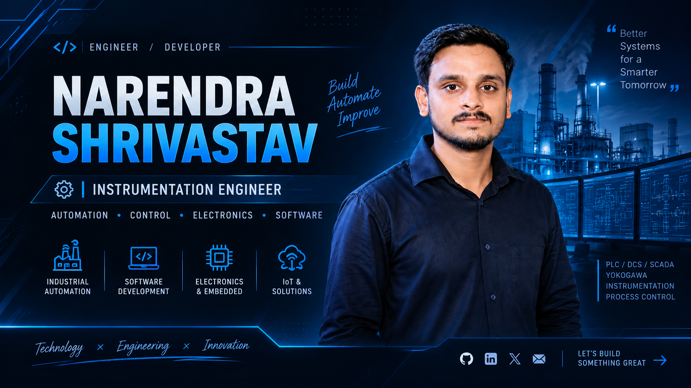

# 👋 Hi, I'm Narendra Shrivastav

### Instrumentation Engineer | Automation & Control | Developer

⚙️ Industrial Automation • 💻 Software • 🔌 Electronics • 🤖 IoT

  
  

---

## 👨‍💻 About Me

I'm **Narendra Shrivastav**, an **Instrumentation Engineer** with hands-on experience in industrial automation, process control, and power-plant instrumentation.

My work revolves around **DCS, PLC, SCADA, process instrumentation, control systems, calibration, commissioning, and troubleshooting**.

Beyond industrial automation, I'm interested in **software development, electronics, embedded systems, IoT, and automation projects**. I enjoy building practical systems that connect the physical and digital worlds.

### ⚡ What drives me

> **Build. Automate. Improve.**

I'm constantly exploring new technologies and looking for ways to combine **engineering + software + electronics** to solve real-world problems.
---

<h2>⚙️ What I Do</h2>

  
  
  
  

<strong>⚙️ Industrial Automation</strong>

 

I work with industrial automation and control systems, including:

- **DCS** — Distributed Control Systems
- **PLC** — Programmable Logic Controllers
- **SCADA** — Supervisory Control and Data Acquisition
- Control logic and sequence implementation
- Interlocks and permissive logic
- Alarm and trip systems
- Industrial troubleshooting
- Commissioning and maintenance

**Core focus:**

`DCS` `PLC` `SCADA` `Interlocks` `Control Logic` `Process Automation`

<strong>🏭 Process Control & Instrumentation</strong>

 

My instrumentation work includes:

- Process measurement and instrumentation
- Pressure, temperature, flow and level measurement
- Control valves and actuators
- Instrument calibration
- Loop checking and troubleshooting
- P&ID interpretation
- Commissioning activities
- Preventive and breakdown maintenance

**Core focus:**

`Instrumentation` `Calibration` `Control Valves` `P&ID` `Loop Checking` `Commissioning`

<strong>💻 Software Development</strong>

 

I'm also exploring software development and building practical applications and automation tools.

- Python
- JavaScript
- HTML / CSS
- Firebase
- Git & GitHub
- Web applications
- Automation scripts
- API-based projects

**Core focus:**

`Python` `JavaScript` `HTML` `CSS` `Firebase` `Git` `GitHub`

<strong>🔌 Embedded Systems & IoT</strong>

 

I enjoy working at the intersection of electronics, hardware and software.

- ESP8266
- Raspberry Pi
- Arduino
- Sensors and electronics
- IoT systems
- Hardware automation
- Embedded programming
- Experimental automation projects

**Core focus:**

`ESP8266` `Raspberry Pi` `Arduino` `IoT` `Electronics` `Embedded Systems`

